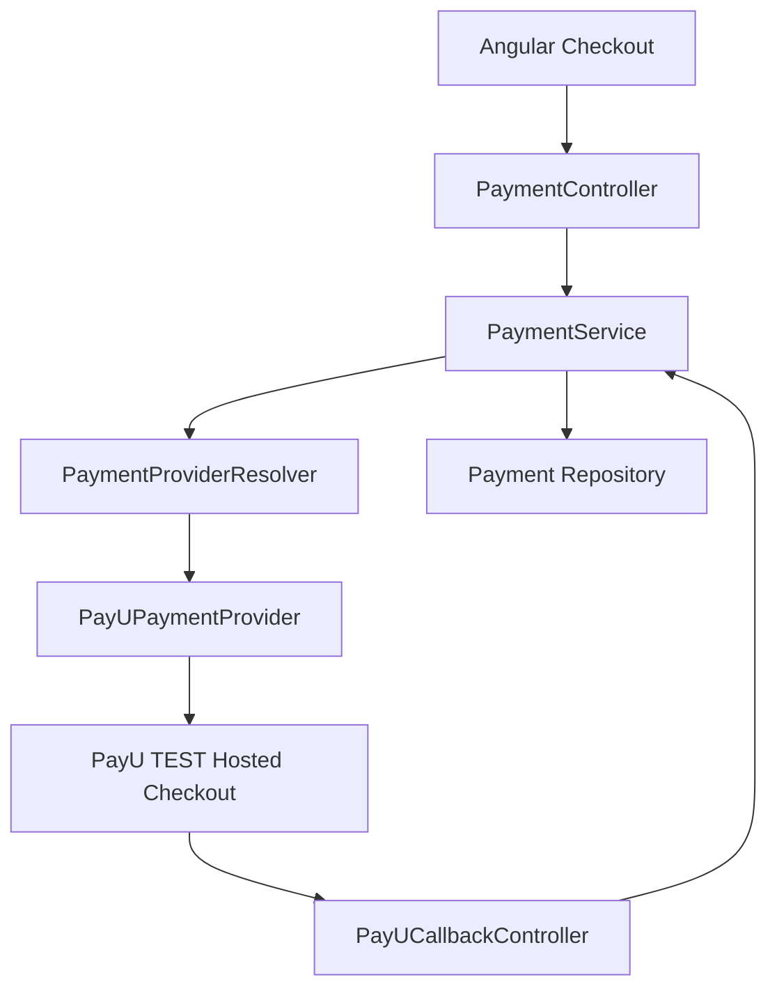
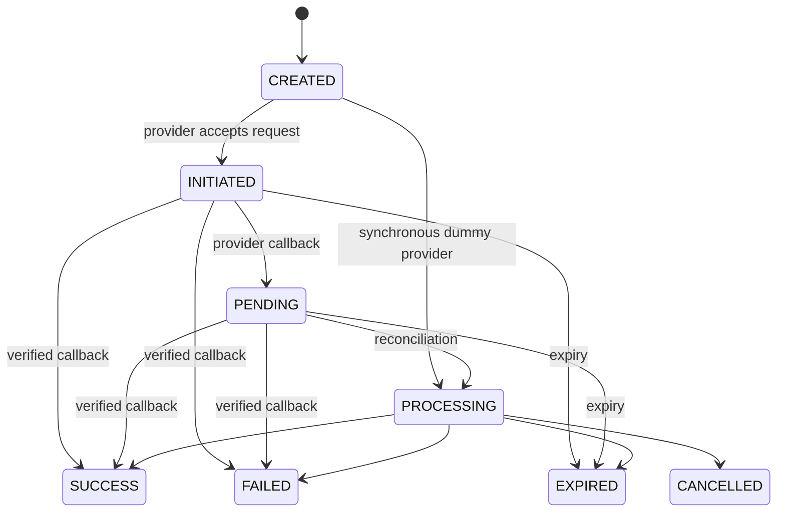

# Payment Architecture

## Current architecture

The Angular checkout calls `POST /api/payments`. Spring Boot owns payment creation, idempotency, state transitions, provider selection, and callback reconciliation. The repository is currently in memory and is intended to be replaced by a database or Redis-backed implementation for distributed deployments.



## Multi-provider design

`PaymentProvider` is the strategy boundary. A provider supplies a generic initiation result, provider identity, supported methods, and optional legacy operations. `PaymentProviderResolver` discovers Spring provider beans and resolves them from `Provider`.

PayU is implemented now. Razorpay, Stripe, and Adyen are extension points only; no fake implementations are registered.

The response contains only generic hosted-checkout data:

- `paymentId`
- `provider`
- `status`
- `checkoutUrl`
- `checkoutFields`

The checkout fields are generated server-side. Salt and other configuration never leave the backend.

## PayU TEST integration

The current adapter uses the PayU hosted checkout form flow. `PayUPaymentProvider` owns PayU field construction and `PayUHashService` owns SHA-512 request and response verification. The browser receives a form action and fields, then posts to the configured TEST endpoint.

The public callback is:

`POST /api/payments/providers/payu/callback`

The callback is treated as untrusted until its response hash, payment reference, amount, currency, and provider state are validated.

The PayU documentation portal should be checked against the merchant account's current hosted-checkout contract before enabling test traffic. The adapter is intentionally isolated so field changes do not affect the domain service or Angular UI.

## Configuration

No credentials are committed. Set these environment variables in the backend runtime:

```text
PAYU_TEST_ENABLED=true
PAYU_TEST_KEY=<your-test-key>
PAYU_TEST_SALT=<your-test-salt>
PAYU_TEST_BASE_URL=https://test.payu.in/_payment
PAYU_TEST_SUCCESS_URL=http://localhost:8080/api/payments/providers/payu/callback
PAYU_TEST_FAILURE_URL=http://localhost:8080/api/payments/providers/payu/callback
```

The application defaults PayU to disabled when the environment is not configured. `application.yml` contains only placeholders and safe test endpoint defaults.

## Payment lifecycle



Terminal states cannot transition back to a pending or processing state.

## Idempotency

`idempotencyKey` is resolved before a provider call. A repeated key returns the existing payment and does not create another provider transaction. Production Spring profiles use the JPA payment repository with a unique database constraint on `idempotency_key`; the map-backed repository remains only for explicit test profiles.

Payment persistence uses two tables:

- `payments`: the current provider-independent payment snapshot and status.
- `payment_transaction_events`: append-only request, provider initiation, and callback/status events.

Only safe metadata is stored in event details. Card numbers, CVV, UPI PINs, PayU salt, and raw provider payloads are never persisted.

## Amount validation

This repository does not currently contain an order aggregate or order service. To avoid silently trusting the browser for PayU payments, the current implementation uses `ConfiguredOrderAmountResolver` for the demo order `ORD-10001` and amount `1768.82`. Unknown PayU orders and amount mismatches are rejected.

Replace that resolver with the real order service before accepting real business orders. The frontend amount remains display data; the backend resolver is authoritative.

## Callback flow

1. PayU posts the form response to the dedicated callback endpoint.
2. The callback controller verifies the response hash using the backend-only salt.
3. The payment is located by provider transaction ID.
4. Amount and currency are compared with the stored payment.
5. PayU status is mapped to the provider-independent state.
6. The domain state machine accepts or rejects the transition.
7. The payment is persisted and returned without exposing secrets.

Notification delivery is independent of payment state and must not decide success.

## API summary

- `GET /api/payments/providers` returns enabled provider metadata.
- `POST /api/payments` creates a payment or hosted checkout session.
- `GET /api/payments/{paymentId}` returns the stored payment.
- `GET /api/payments/{paymentId}/status` returns current status.
- `POST /api/payments/providers/payu/callback` reconciles a verified PayU form response.

## Local testing

1. Set the PayU TEST environment variables in the backend process only.
2. Start the Spring Boot API and Angular app.
3. Open `/v1/payments` and select an enabled provider.
4. The checkout posts to the configured PayU TEST endpoint when PayU is enabled.
5. Use a fresh idempotency key for each new test payment.

The callback should be tested with captured PayU TEST responses only after confirming the merchant account's current hash contract. Never use production credentials or production endpoints.

## Failure simulation

- Unknown PayU order ID: rejected by the order resolver.
- Amount mismatch: rejected before provider initiation.
- Missing PayU environment variables: provider is unavailable.
- Invalid callback hash: callback returns `400` and does not update payment state.
- Invalid callback amount or currency: callback is rejected.
- Dummy provider tests may continue using order IDs containing `FAIL` or `DECLINE`.

## Adding another provider

1. Implement `PaymentProvider`.
2. Add provider-specific configuration.
3. Add provider request, response, status, and callback mapping inside that adapter package.
4. Register the implementation as a Spring component.
5. Add provider-focused tests.

`PaymentController`, `PaymentService`, the payment entity, and Angular checkout should not require provider-specific branching.

## Security

- PayU salt and key are backend configuration only.
- Secrets are never logged or returned by REST APIs.
- Callbacks are verified before state changes.
- Amount and currency are checked against stored payment data.
- Idempotency is enforced by the backend.
- Card CVV, UPI PIN, and full card data are not stored.

## Production gaps

- Replace the in-memory repository with transactional persistence and unique constraints.
- Replace the configured demo order resolver with the authenticated order service.
- Add authenticated customer/order ownership checks.
- Add durable provider transaction records and callback event audit records.
- Add provider timeout/retry/reconciliation jobs.
- Confirm the current PayU merchant-specific hash and callback contract before enabling UAT traffic.
- Add structured correlation logging with masked provider references.
- Add integration tests using PayU's official current TEST examples.
